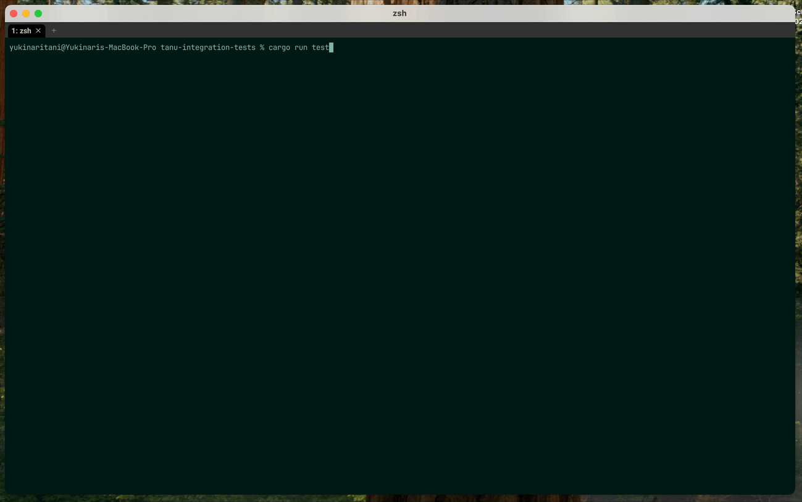
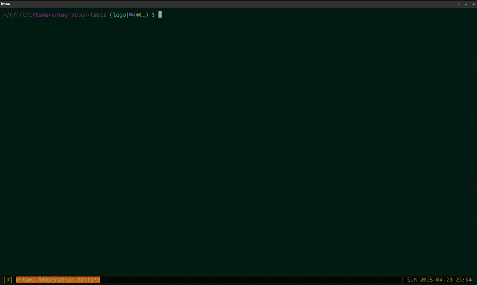
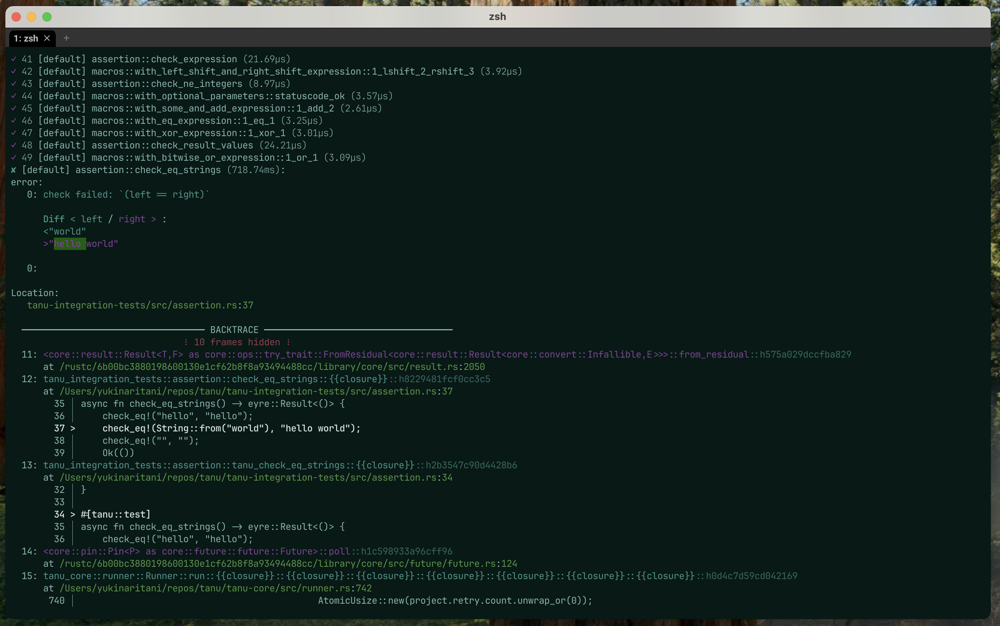

<h1 align="center">tanu</h1>
<p align="center">High-performance, async-friendly and ergonomic WebAPI testing framework for Rust</p>
<p align="center"></p>
<p align="center">
<a href="https://crates.io/crates/tanu"></a>
<a href="https://github.com/tanu-rs/tanu/blob/main/LICENSE"></a>
<a href="https://docs.rs/tanu"></a>
</p>
<p align="center">
<a href="https://tanu-rs.github.io/tanu/">Documentation</a> ·
<a href="https://tanu-rs.github.io/tanu/getting-started/">Getting Started</a> ·
<a href="https://docs.rs/tanu">API Reference</a> ·
<a href="https://github.com/tanu-rs/tanu/tree/main/examples">Examples</a>
</p>

tanu is a framework for writing end-to-end tests against HTTP, gRPC, and GraphQL APIs in plain Rust. Tests are ordinary `async` functions; tanu discovers them at compile time, runs them concurrently, and gives you a CLI and an interactive TUI to run and inspect them.

## Features

- **Plain async Rust tests** – annotate an `async fn` with `#[tanu::test]`; no harness boilerplate.
- **Parameterized tests** – stack `#[tanu::test(args...)]` attributes to generate one test case per input.
- **Concurrent by default** – tests run in parallel, with `serial` groups and `ordered` modules when you need sequencing.
- **Built-in HTTP client** – every request and response is captured for debugging, with credentials masked automatically.
- **gRPC and GraphQL** – capture tonic calls through Tower middleware, and send runtime or type-safe GraphQL queries.
- **Assertion macros** – `check!`, `check_eq!`, `check_ne!`, `check_str_eq!` with colored diffs.
- **Multi-environment projects** – run the same suite against `dev`, `staging`, and `production` from one `tanu.toml`.
- **Retries, filters, fail-fast** – configurable exponential backoff, project/module/test filters, and allowlists.
- **CLI and TUI** – run in CI with the CLI, or browse requests, headers, and payloads interactively in the TUI.
- **Pluggable reporters** – write your own or use [tanu-allure](https://github.com/tanu-rs/tanu-allure) for Allure reports.

## Quick Start

Create a binary crate and add tanu with tokio:

```bash
cargo new my-api-tests
cd my-api-tests
cargo add tanu
cargo add tokio --features full
```

Replace `src/main.rs` with:

```rust
use tanu::{check, check_eq, eyre, http::Client};

#[tanu::test]
async fn get_returns_200() -> eyre::Result<()> {
    let http = Client::new();
    let res = http.get("https://httpbin.org/get").send().await?;
    check!(res.status().is_success(), "unexpected status: {}", res.status());
    Ok(())
}

// One test case is generated per attribute.
#[tanu::test(200)]
#[tanu::test(404)]
#[tanu::test(500)]
async fn status_codes(expected: u16) -> eyre::Result<()> {
    let http = Client::new();
    let res = http
        .get(format!("https://httpbin.org/status/{expected}"))
        .send()
        .await?;
    check_eq!(expected, res.status().as_u16());
    Ok(())
}

#[tanu::main]
#[tokio::main]
async fn main() -> eyre::Result<()> {
    let runner = run();
    let app = tanu::App::new();
    app.run(runner).await?;
    Ok(())
}
```

Run the tests:

```bash
cargo run -- test               # run all tests in CLI mode
cargo run -- test --capture-http # also print HTTP requests/responses
cargo run -- tui                # interactive terminal UI
cargo run -- ls                 # list discovered tests
```

```text
✓ 1 [default] my_api_tests::get_returns_200 (412.08ms)
✓ 2 [default] my_api_tests::status_codes::200 (398.51ms)
✓ 3 [default] my_api_tests::status_codes::404 (401.77ms)
✓ 4 [default] my_api_tests::status_codes::500 (405.12ms)

Tests: 4 passed, 0 failed, 4 total
```

See the [Getting Started guide](https://tanu-rs.github.io/tanu/getting-started/) for a full walkthrough.

## Configuration

Projects in `tanu.toml` let you run the same tests against several environments. Arbitrary keys are available to tests through `tanu::get_config()`:

```toml
[runner]
capture_http = "on-failure"
concurrency = 8

[[projects]]
name = "staging"
base_url = "https://staging.api.example.com"
retry.count = 3

[[projects]]
name = "production"
base_url = "https://api.example.com"
test_ignore = ["my_api_tests::destructive::delete_account"]
```

```rust
#[tanu::test]
async fn health() -> eyre::Result<()> {
    let base_url = tanu::get_config().get_str("base_url")?.to_string();
    let res = Client::new().get(format!("{base_url}/health")).send().await?;
    check!(res.status().is_success());
    Ok(())
}
```

Values can also come from environment variables or a `.env` file (`TANU_API_KEY`, `TANU_STAGING_API_KEY`). See [Configuration](https://tanu-rs.github.io/tanu/configuration/).

## Feature Flags

| Feature | Default | Description |
|---|---|---|
| `native-tls` | ✓ | TLS via the platform's native stack |
| `rustls-tls-webpki-roots` | | TLS via rustls with bundled Mozilla roots (use with `default-features = false`) |
| `rustls-tls-native-roots` | | TLS via rustls with the OS certificate store (use with `default-features = false`) |
| `json` | | `RequestBuilder::json` for sending JSON bodies (`Response::json` is always available) |
| `cookies` | | `Response::cookies` |
| `grpc` | | gRPC call capture for [tonic](https://github.com/hyperium/tonic) channels |
| `graphql` | | GraphQL request builder (enables `json`) |

```toml
[dependencies]
tanu = { version = "0.22", features = ["json", "cookies"] }
```

## Screenshots

The CLI runs tests and prints results in your terminal.
<p></p>

The TUI lets you run tests and inspect HTTP calls interactively.
<p></p>

Failures come with colored backtraces from color-eyre.
<p></p>

Test reports with [tanu-allure](https://github.com/tanu-rs/tanu-allure).
<p></p>

## Documentation

| Topic | |
|---|---|
| [Getting Started](https://tanu-rs.github.io/tanu/getting-started/) | Install tanu and write your first test |
| [Test Attributes](https://tanu-rs.github.io/tanu/attribute/) | `#[tanu::test]`, parameterized tests, serial groups |
| [Ordered Execution](https://tanu-rs.github.io/tanu/ordered-execution/) | Run a module's tests in source order |
| [Assertions](https://tanu-rs.github.io/tanu/assertion/) | `check!` and friends |
| [gRPC](https://tanu-rs.github.io/tanu/grpc/) / [GraphQL](https://tanu-rs.github.io/tanu/graphql/) | Protocol-specific testing |
| [Configuration](https://tanu-rs.github.io/tanu/configuration/) | `tanu.toml`, env vars, retries, masking |
| [Command Line Options](https://tanu-rs.github.io/tanu/command-line-option/) | `test`, `tui`, `ls` |
| [Reporters](https://tanu-rs.github.io/tanu/report/) | Custom reporters and Allure |
| [FAQ](https://tanu-rs.github.io/tanu/faq/) | Common questions and troubleshooting |

## Why tanu?

As a long-time backend engineer, I wanted API tests that were fast, type-safe, and written in the same language as the services they test. The tools I tried each fell short:

- **Postman** is a great tool, but not designed for end-to-end API testing. It needs a GUI, assertions are written in JavaScript, and collections become huge JSON files that are hard to review and maintain.
- **Playwright** is excellent for web end-to-end testing and supports API testing, but I wanted to write tests in the same language as the API implementation.
- **Rust's built-in `#[test]`** with [tokio](https://crates.io/crates/tokio), [test-case](https://crates.io/crates/test-case), and [reqwest](https://crates.io/crates/reqwest) works, but lacks the structure needed at scale: multiple environments, request capture, retries, reporting, and a way to browse results.

tanu aims to be a dedicated framework for that job while staying plain Rust.

## Contributing

Issues and pull requests are welcome. To work on tanu itself:

```bash
cargo build --workspace
cargo test --workspace
cargo run -p tanu-integration-tests -- test   # requires Docker (httpbin container)
mkdocs serve                                  # preview the documentation site
```

See [CLAUDE.md](CLAUDE.md) for the full pre-PR checklist (fmt, clippy for both TLS backends, builds, integration tests) and commit conventions.

## Contributors

Thanks to all the amazing people who have contributed to making tanu better! Every contribution, big or small, helps build a more robust and feature-rich testing framework for the Rust community ✨

<a href="https://github.com/tanu-rs/tanu/graphs/contributors">
  
</a>

Made with [contrib.rocks](https://contrib.rocks).

## Acknowledgments

We're grateful to our sponsors who support the development of tanu:

<table>
<tr>
<td align="center">
<a href="https://github.com/yuk1ty">

<br />
<sub><b>yuk1ty</b></sub>
</a>
<br />
🐶
</td>
<td align="center">
<a href="https://github.com/2323-code">

<br />
<sub><b>2323-code</b></sub>
</a>
<br />
🥩
</td>
</tr>
</table>

Your support helps make tanu better for everyone. Thank you! 🙏

## License

Licensed under the [Apache License 2.0](LICENSE).
