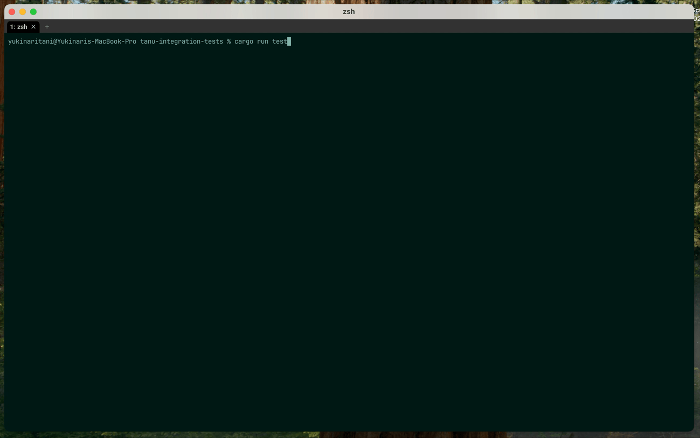
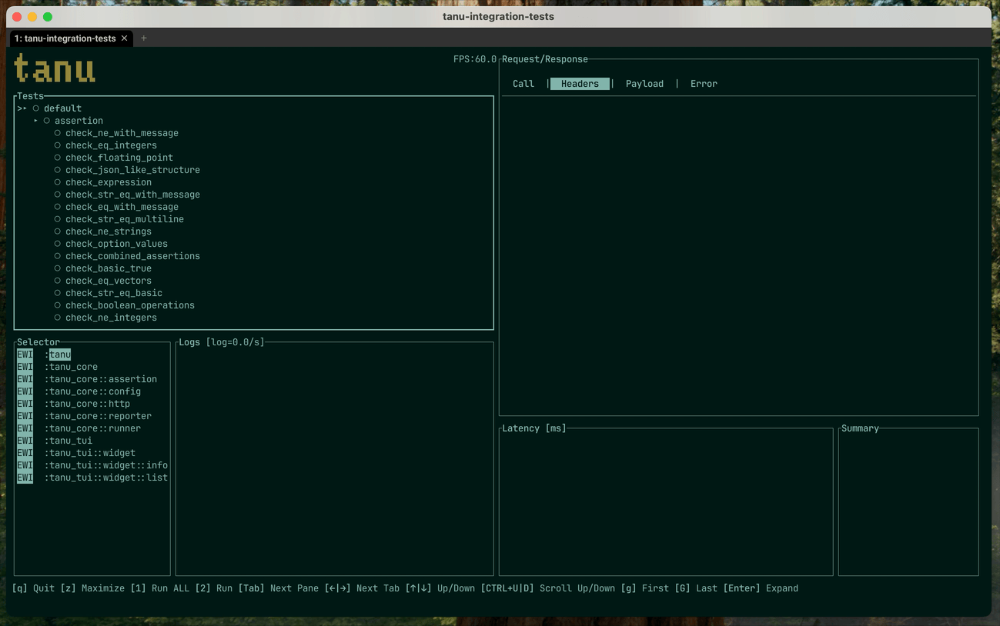

<h1 align="center">tanu</h1>
<p align="center">High-performance, async-friendly and ergonomic WebAPI testing framework for Rust</p>
<p align="center"></p>
<p align="center">
<a href="https://crates.io/crates/tanu"></a>
<a href="https://github.com/tanu-rs/tanu/blob/main/LICENSE"></a>
<a href="https://docs.rs/tanu"></a>
</p>

## Motivation

As a long time backend engineer, I have always been passionate about building reliable and efficient systems. When working with WebAPIs, ensuring correctness, stability, and performance is crucial, yet I often found existing testing frameworks lacking in speed, flexibility, or Rust-native support. This led me to create a WebAPI testing framework in Rust.

While some WebAPI testing tools exist for Rust, they often lack ergonomics, are too low-level, or don't integrate well with modern Rust web frameworks. My goal was to create a framework that is:

- **Fast and lightweight** – Leveraging Rust’s zero-cost abstractions to minimize unnecessary overhead.
- **Type-safe and ergonomic** – Taking advantage of Rust’s strong type system to prevent common errors at compile time.
- **Easily extensible** – Allowing developers to integrate custom assertions, mocking, and performance metrics seamlessly.
- **Concurrency and async-friendly** – Supporting asynchronous requests and concurrent execution to test APIs efficiently.

I tried multiple solutions in the past but encountered significant limitations:

- **Postman** - Postman is a great tool but not designed for API end-to-end testing. You need a GUI and have to write assertions in JavaScript, which results in massive JSON files that become difficult to manage.
- **Playwright** - Playwright is an excellent framework for web end-to-end testing. While it does support API testing, I wanted to use the same language for both API implementation and tests, which Playwright does not offer.
- **Rust Standard Test Framework** - I attempted multiple times to write API tests using `#[test]`, along with [tokio](https://crates.io/crates/tokio), [test-case](https://crates.io/crates/test-case), and [reqwest](https://crates.io/crates/reqwest) crates. While functional, this approach lacked structure and ergonomics for writing effective tests at scale. I wanted a dedicated framework to simplify and streamline the process.

## Writing Tests with Tanu

Writing API tests with tanu is designed to be intuitive and ergonomic. Here's what a typical test looks like:

```rust
use tanu::{check, check_eq, eyre, http::Client};

#[tanu::test]
async fn get_user_profile() -> eyre::Result<()> {
    let client = Client::new();
    
    // Make HTTP request
    let response = client
        .get("https://api.example.com/users/123")
        .header("authorization", "Bearer token123")
        .send()
        .await?;
    
    // Verify response
    check!(response.status().is_success(), "Expected successful response");
    
    // Parse and validate JSON
    let user: serde_json::Value = response.json().await?;
    check_eq!(123, user["id"].as_i64().unwrap());
    check_eq!("John Doe", user["name"].as_str().unwrap());
    
    Ok(())
}

// Parameterized tests for testing multiple scenarios
#[tanu::test(200)]
#[tanu::test(404)]
#[tanu::test(500)]
async fn test_status_codes(expected_status: u16) -> eyre::Result<()> {
    let client = Client::new();
    let response = client
        .get(&format!("https://httpbin.org/status/{expected_status}"))
        .send()
        .await?;
    
    check_eq!(expected_status, response.status().as_u16());
    Ok(())
}

#[tanu::main]
#[tokio::main]
async fn main() -> eyre::Result<()> {
    let runner = run();
    let app = tanu::App::new();
    app.run(runner).await?;
    Ok(())
}
```

### Key Features Highlighted:

- **Simple and Clean**: Tests look like regular Rust functions with the `#[tanu::test]` attribute
- **Async/Await Native**: Full support for async operations without boilerplate
- **Type-Safe**: Leverage Rust's type system for robust API testing
- **Ergonomic Assertions**: Use `check!`, `check_eq!`, and other assertion macros for clear test validation
- **Parameterized Testing**: Test multiple scenarios with different inputs using multiple `#[tanu::test(param)]` attributes
- **Built-in HTTP Client**: No need to set up reqwest or other HTTP clients manually
- **Error Handling**: Clean error propagation with `eyre::Result`

## Screenshots

<p></p>
<p></p>

## License

This project is licensed under the Apache License 2.0 - see the [LICENSE](LICENSE) file for details.

The Apache License 2.0 is a permissive open source license that allows you to:
- Use the software for any purpose
- Distribute it
- Modify it
- Distribute modified versions
- Place warranty

For more information about the Apache License 2.0, visit: http://www.apache.org/licenses/LICENSE-2.0
