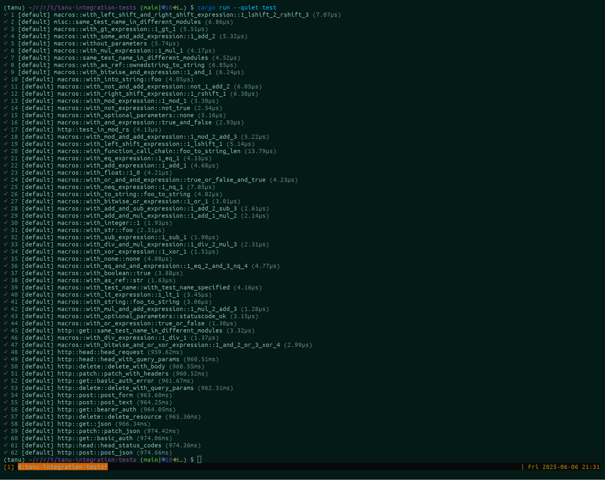

---
hide:
  - navigation
  - toc
---

<div class="tanu-hero" markdown>

<div markdown>

# tanu

<p class="tanu-hero__tagline">High-performance, async-friendly and ergonomic WebAPI testing framework for Rust.</p>

[Get started](getting-started.md){ .md-button .md-button--primary }
[View on GitHub](https://github.com/tanu-rs/tanu){ .md-button }

<p class="tanu-hero__install"><code>cargo add tanu</code></p>

[](https://crates.io/crates/tanu)
[](https://github.com/tanu-rs/tanu/blob/main/LICENSE)
[](https://docs.rs/tanu)

</div>


</div>

tanu is a framework for writing end-to-end tests against HTTP, gRPC, and GraphQL APIs in plain Rust. Tests are ordinary `async` functions; tanu discovers them at compile time, runs them concurrently, and gives you a CLI and an interactive TUI to run and inspect them.

## Features

<div class="grid cards" markdown>

-   :material-language-rust:{ .lg .middle } **Plain async Rust**

    ---

    Annotate an `async fn` with `#[tanu::test]`. No harness boilerplate, and your tests can reuse your service's types.

    [:octicons-arrow-right-24: Test attributes](attribute.md)

-   :material-table-multiple:{ .lg .middle } **Parameterized tests**

    ---

    Stack `#[tanu::test(args...)]` attributes to generate one named test case per input.

    [:octicons-arrow-right-24: Parameterized tests](attribute.md#parameterized-tests)

-   :material-lightning-bolt:{ .lg .middle } **Concurrent by default**

    ---

    Tests run in parallel, with `serial` groups and `ordered` modules when steps must not overlap.

    [:octicons-arrow-right-24: Ordered execution](ordered-execution.md)

-   :material-check-decagram:{ .lg .middle } **Assertions that report**

    ---

    `check!`, `check_eq!`, `check_ne!`, and `check_str_eq!` return errors with colored diffs instead of panicking.

    [:octicons-arrow-right-24: Assertions](assertion.md)

-   :material-web:{ .lg .middle } **HTTP, gRPC, GraphQL**

    ---

    A built-in HTTP client, call capture for tonic channels, and runtime or type-safe GraphQL queries.

    [:octicons-arrow-right-24: gRPC](grpc.md) · [GraphQL](graphql.md)

-   :material-earth:{ .lg .middle } **Multiple environments**

    ---

    Run the same suite against dev, staging, and production, with per-project settings, retries, and allowlists.

    [:octicons-arrow-right-24: Configuration](configuration.md)

-   :material-shield-lock:{ .lg .middle } **Safe request logs**

    ---

    Every call is captured for debugging, with tokens, keys, and passwords masked in headers, query strings, and bodies.

    [:octicons-arrow-right-24: Credential masking](configuration.md#credential-masking)

-   :material-console:{ .lg .middle } **CLI and TUI**

    ---

    Run in CI from the CLI, or browse requests, headers, and payloads interactively in the terminal UI.

    [:octicons-arrow-right-24: TUI](tui.md)

-   :material-file-chart:{ .lg .middle } **Pluggable reporters**

    ---

    Write your own reporter, or generate Allure reports with tanu-allure.

    [:octicons-arrow-right-24: Reporters](report.md)

</div>

## A taste of tanu

=== "Test"

    ```rust
    use tanu::{check, check_eq, eyre, http::Client};

    #[tanu::test]
    async fn get_returns_200() -> eyre::Result<()> {
        let http = Client::new();
        let res = http.get("https://httpbin.org/get").send().await?;
        check!(res.status().is_success(), "unexpected status: {}", res.status());
        Ok(())
    }

    // One test case is generated per attribute.
    #[tanu::test(200)]
    #[tanu::test(404)]
    #[tanu::test(500)]
    async fn status_codes(expected: u16) -> eyre::Result<()> {
        let http = Client::new();
        let res = http
            .get(format!("https://httpbin.org/status/{expected}"))
            .send()
            .await?;
        check_eq!(expected, res.status().as_u16());
        Ok(())
    }

    #[tanu::main]
    #[tokio::main]
    async fn main() -> eyre::Result<()> {
        let runner = run();
        let app = tanu::App::new();
        app.run(runner).await?;
        Ok(())
    }
    ```

=== "Run"

    ```bash
    cargo run -- test
    ```

    ```text
    ✓ 1 [default] my_api_tests::get_returns_200 (412.08ms)
    ✓ 2 [default] my_api_tests::status_codes::200 (398.51ms)
    ✓ 3 [default] my_api_tests::status_codes::404 (401.77ms)
    ✓ 4 [default] my_api_tests::status_codes::500 (405.12ms)

    Tests: 4 passed, 0 failed, 4 total
    ```

=== "tanu.toml"

    ```toml
    [runner]
    capture_http = "on-failure"

    [[projects]]
    name = "staging"
    base_url = "https://staging.api.example.com"
    retry.count = 3

    [[projects]]
    name = "production"
    base_url = "https://api.example.com"
    test_ignore = ["my_api_tests::destructive::delete_account"]
    ```

## Screenshots

=== "CLI"

    

=== "TUI"

    

=== "Allure"

    

## Why tanu?

As a long-time backend engineer, I wanted API tests that were fast, type-safe, and written in the same language as the services they test. The tools I tried each fell short:

- **Postman** is a great tool, but not designed for end-to-end API testing. It needs a GUI, assertions are written in JavaScript, and collections become huge JSON files that are hard to review and maintain.
- **Playwright** is excellent for web end-to-end testing and supports API testing, but I wanted to write tests in the same language as the API implementation.
- **Rust's built-in `#[test]`** with [tokio](https://crates.io/crates/tokio), [test-case](https://crates.io/crates/test-case), and [reqwest](https://crates.io/crates/reqwest) works, but lacks the structure needed at scale: multiple environments, request capture, retries, reporting, and a way to browse results.

tanu aims to be a dedicated framework for that job while staying plain Rust.

## Community

Thanks to everyone who has contributed to tanu ✨

[](https://github.com/tanu-rs/tanu/graphs/contributors)

And to our sponsors, [yuk1ty](https://github.com/yuk1ty) 🐶 and [2323-code](https://github.com/2323-code) 🥩, for supporting development. 🙏

tanu is licensed under the [Apache License 2.0](https://github.com/tanu-rs/tanu/blob/main/LICENSE).
