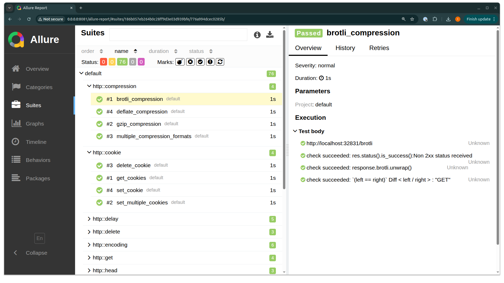

# Reporters

Reporters receive events from the test runner — test start, checks, HTTP/gRPC calls, retries, results, and the final summary — and turn them into output. You can enable several at once.

```bash
cargo run -- test --reporters list,allure
```

## Built-in reporters

| Name | Description |
|---|---|
| `list` | Default. Prints one line per test as it finishes, followed by captured HTTP logs (depending on `--capture-http`) and a summary. |

## Allure

[tanu-allure](https://github.com/tanu-rs/tanu-allure) writes Allure-compatible JSON for each test. HTTP calls, assertions, and timings appear in the Allure dashboard without extra plumbing.

{ .tanu-shot }

Add the crate:

```toml
[dependencies]
tanu-allure = "0.8"
```

Register the reporter in `main`:

```rust
#[tanu::main]
#[tokio::main]
async fn main() -> tanu::eyre::Result<()> {
    let runner = run();
    let mut app = tanu::App::new();
    app.install_reporter(
        "allure",
        tanu_allure::AllureReporter::with_results_dir("allure-results"),
    );
    app.run(runner).await
}
```

Run the tests with the reporter enabled, then generate or serve the report with the [Allure CLI](https://allurereport.org/docs/install/):

```bash
cargo run -- test --reporters allure,list
allure serve allure-results
```

See the [tanu-allure repository](https://github.com/tanu-rs/tanu-allure) for the latest version and a GitHub Actions workflow that publishes reports to GitHub Pages.

## Writing a custom reporter

Implement the [`Reporter`](https://docs.rs/tanu/latest/tanu/reporter/trait.Reporter.html) trait. Every method has a default implementation, so override only the events you care about:

| Method | Called when |
|---|---|
| `on_start` | A test starts |
| `on_check` | A `check!` macro succeeds or fails |
| `on_call` | An HTTP or gRPC call completes |
| `on_retry` | A failed test is about to be retried |
| `on_end` | A test finishes |
| `on_summary` | All tests have finished |

```rust
use tanu::{async_trait, eyre, reporter::Reporter, runner};

#[derive(Default)]
struct FailureCounter {
    failed: Vec<String>,
}

#[async_trait::async_trait]
impl Reporter for FailureCounter {
    async fn on_end(
        &mut self,
        project: String,
        module: String,
        test_name: String,
        test: runner::Test,
    ) -> eyre::Result<()> {
        if test.result.is_err() {
            self.failed.push(format!("[{project}] {module}::{test_name}"));
        }
        Ok(())
    }

    async fn on_summary(&mut self, summary: runner::TestSummary) -> eyre::Result<()> {
        println!("{} of {} tests failed", summary.failed_tests, summary.total_tests);
        for name in &self.failed {
            println!("  {name}");
        }
        Ok(())
    }
}
```

Install it under a name, and select it with `--reporters`:

```rust
let mut app = tanu::App::new();
app.install_reporter("failures", FailureCounter::default());
app.run(runner).await?;
```

```bash
cargo run -- test --reporters list,failures
```
