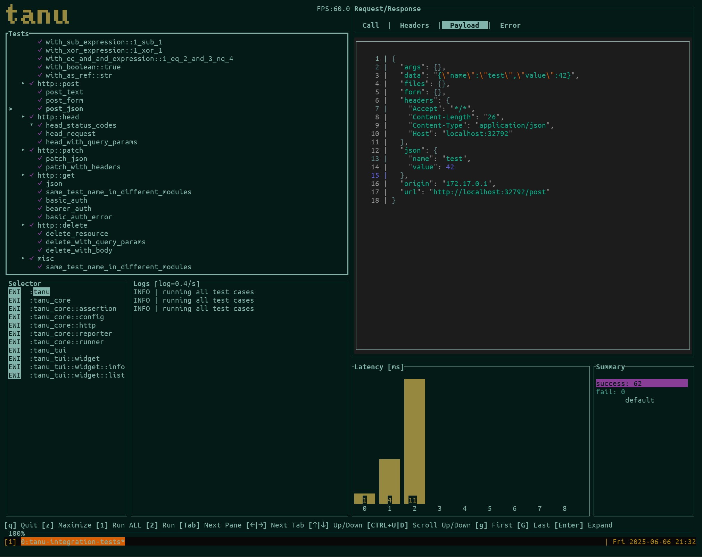

# TUI

The TUI lets you browse tests, run all or some of them, and inspect every HTTP or gRPC call they made, without leaving the terminal.

```bash
cargo run -- tui
```

{ .tanu-shot }

## Layout

The screen has a status bar at the top, a key hint bar at the bottom, and several panes in between. Press `Tab` or click a pane to focus it.

| Area | Contents |
|---|---|
| **Status bar** | Run state (idle, running, passed, failed), pass/fail/retry/not-run counts, the pass rate when some tests failed, elapsed time, and projects. |
| **Tests** | Tests grouped by module. With several projects, each project has its own tab showing its pass count (or failures in red); the first row is the project itself, to run or inspect it as a whole. Each row shows its result, and tests also show call count, retries, and duration. Modules show `passed/total`. |
| **Details** | For a single HTTP or gRPC call: four tabs, **Call**, **Headers**, **Payload**, and **Error** (checks and error message). For a project, module, or a test with zero or several calls: an overview with counts, failed tests, slowest tests, and a list of calls. |
| **Logs** | Log output from tanu and from your tests, in a short pane under the tests. The target selector is hidden by default; press `L` to show it. |
| **Charts** | **Timeline**: one lane per worker, with a bar for each test from its start to its end, blue if it passed and muted red if it failed (the same colors as the latency chart). The selected test is highlighted in light blue. The title shows the wall time, the number of workers, and how busy they were. **Latency**: histogram of request latencies on a log scale (<1ms, 1ms, 2ms, 5ms, 10ms, …) with p50, p95, p99, and max. The calls of the selected test are light blue at the bottom of each bar, and error responses (HTTP 4xx/5xx, non-OK gRPC status) are a muted red, since they are often expected. Both charts are shown side by side; when maximized they are stacked. |

## Key bindings

Press `?` in the TUI to see all key bindings.

### Global

| Key | Action |
|---|---|
| `r` (or `2`) | Run the selected project, module, or test |
| `R` (or `1`) | Run all tests |
| `Tab` / `Shift+Tab` | Focus the next / previous pane |
| `[` / `]` | Previous / next Details tab |
| `/` | Search tests and modules by name |
| `f` | Cycle the status filter: all, failed, passed, not run |
| `n` / `N` | Jump to the next / previous failed test |
| `z` | Maximize or restore the focused pane |
| `?` | Show or hide key bindings |
| `Esc` | Clear the search and filter; quit if none is active |
| `q` | Quit |

### Tests

| Key | Action |
|---|---|
| `j` / `↓`, `k` / `↑` | Move the cursor down / up |
| `g` / `Home`, `G` / `End` | Jump to the top / bottom |
| `Ctrl+D` / `Ctrl+U` | Move half a page down / up |
| `Enter` / `Space` | Expand or collapse a project, module, or test (to show its calls) |
| `←` / `→` | Previous / next project tab (with a single project: same as `h` / `l`) |
| `h` | Collapse, or go to the parent |
| `l` | Expand, or go to the first child |

While searching, type to filter the list. `Enter` keeps the query and `Esc` cancels it.

### Details

| Key | Action |
|---|---|
| `h` / `←`, `l` / `→` | Previous / next tab |
| `j` / `↓`, `k` / `↑` | Scroll down / up |
| `g` / `Home`, `G` / `End` | Scroll to the top / bottom |
| `Ctrl+D` / `Ctrl+U` | Scroll down / up half a page |

### Logs

| Key | Action |
|---|---|
| `j` / `↓`, `k` / `↑` | Select a log target |
| `h` / `←`, `l` / `→` | Decrease / increase the log level shown for the selected target |
| `PgUp` / `PgDn` | Scroll the logs |
| `Space` | Toggle hiding of targets that are filtered out |
| `L` / `H` | Show or hide the target selector |
| `F` | Show only the selected target |

### Charts

| Key | Action |
|---|---|
| `z` | Maximize the charts; the timeline lanes get taller when there is room |

### Mouse

Click a pane to focus it, click a row to select it (click again to expand it), and click a tab (details or project) to open it. Click the `✓`, `✘`, or `○` count in the status bar to show only those tests; click it again to show all tests. Click a bar in the timeline to select that test. The mouse wheel scrolls the pane under the cursor.

## Configuration

- Concurrency defaults to the number of logical CPU cores; change it with `-c` or `runner.concurrency`.
- Payload colors come from `[tui] payload.color_theme`. See [TUI theme](configuration.md#tui-theme).
- Credential masking and `runner.max_body_size` apply to the Payload view just as they do to CLI output.
- Set `TANU_TUI_DEBUG=1` to show the frame rate in the status bar.

## Tips

- Press `f` to show only failed tests, then `n` to step through them.
- Maximize the Details pane with `z` to read large payloads.
- Press `r` on a module to run just that module while iterating on it.
- Use `--log-level` and `--tanu-log-level` to control how much appears in the Logs pane. See [Command Line Options](command-line-option.md#tui).
